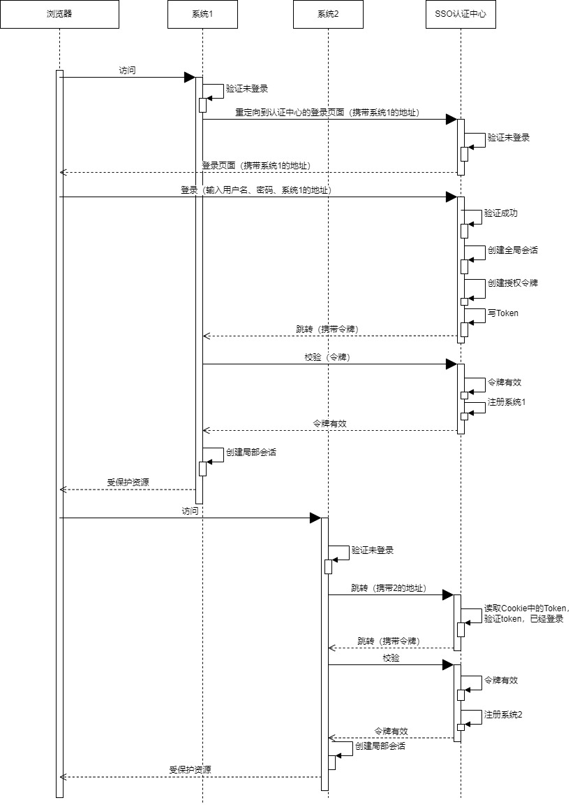
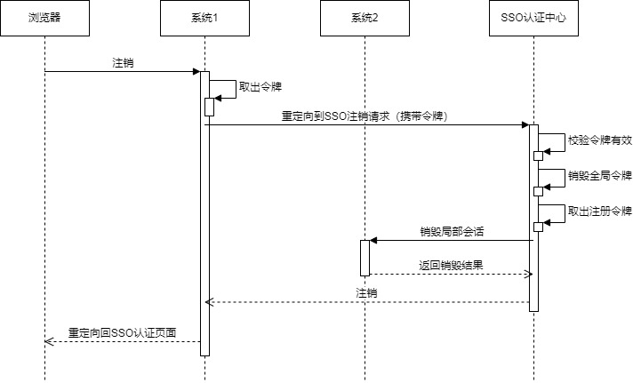

### 单点登录实现原理

单点登录（Single Singn On: SSO）简单来说就是在一个多系统共存的环境下，用户在一个地方登录后，就不需要在其他系统重新登录，也就是用户在一个系统登录成功后就能被其他系统所信任。

单点登录有多种实现方式，这里只是实现了其中一种实现方式，使用一台认证服务器来进行登录认证，各子系统接到请求时会与认证服务器进行交互以读取认证服务器中的认证信息，下图便是登录的时序图：

用户注销的时序图

